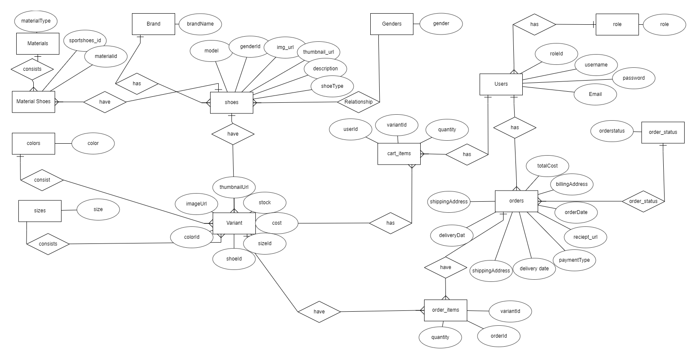
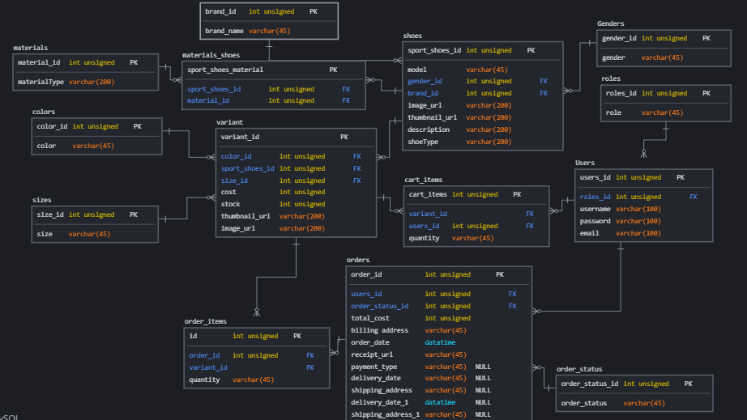
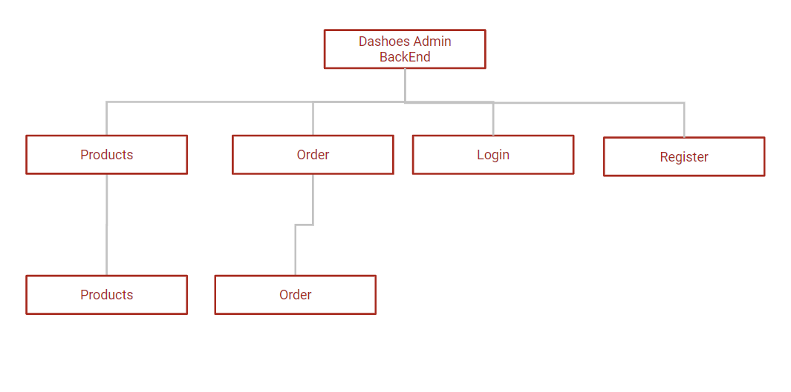
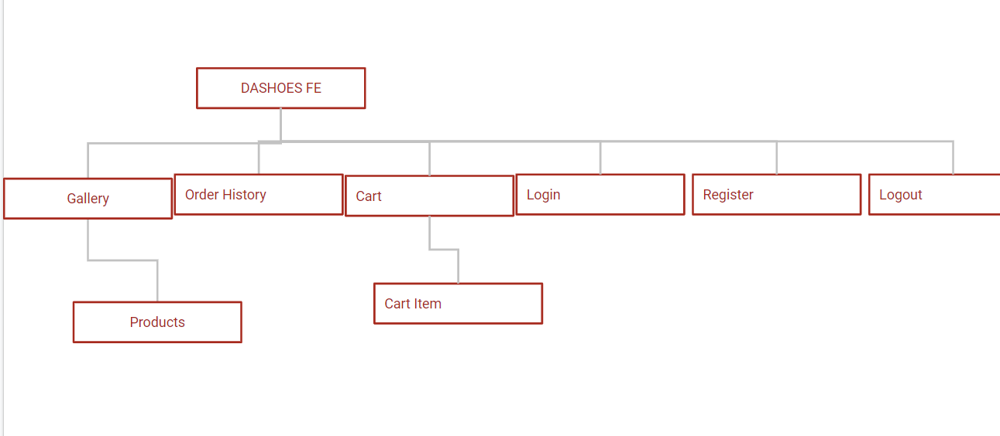
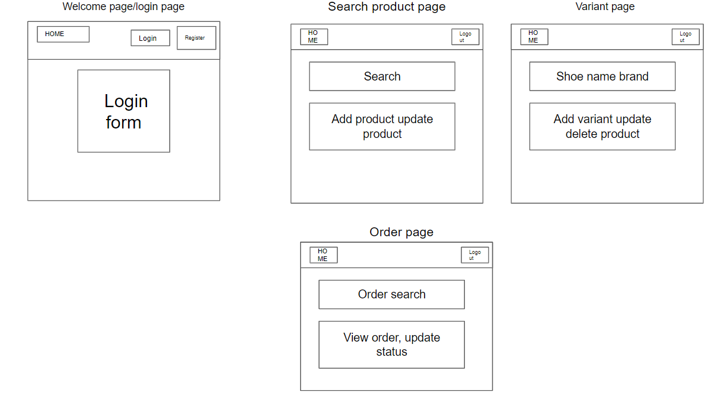
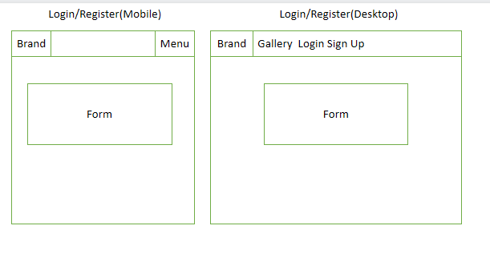
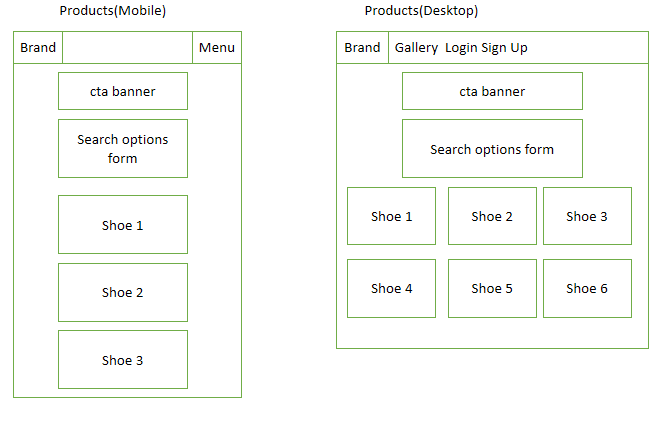
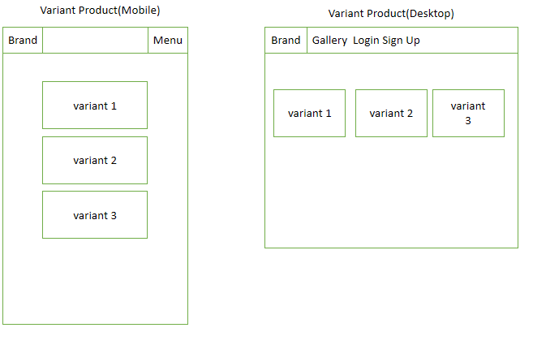
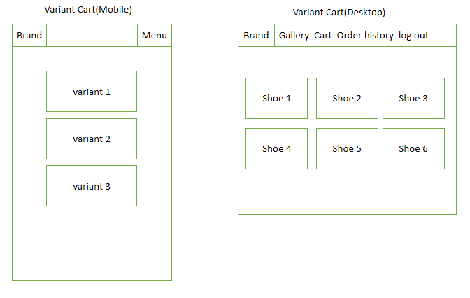

# Welcome to DASHOES!

## Summary
Dashshoes is  an e-commerce web applications for the sport enthusiast. User of the this website will be able to browse a collection of sport shoes based on the type of shoes like for running, cross trainer and etc. User of this website will be able to search whichever brand they prefer as well. User will be able to choose a range of colour based on a specific sport shoes.

## UI/UX

###  Strategy

####  Organisational Goals

Create an amazing website application to sell sport shoe brands that consists of different variant colours

####  User Goals

| User Stories | Accceptance Criteria |
| ------------ | -------------------- |
|As a sport shoes enthusiast,  I would like to see all the brands  | User need to search for by brands
|As a sport shoes enthusiast,  I would like to see all the shoe type| User need to search for shoe types|
| As a sport shoes enthusiast, i would like to be able to see the different variant colours on a specific sport shoe brand| User need to see the brand itself and see the different colours withn a shoe brand|

###  Structure and Skeleton

####  Database



Entity-Relationship Diagram (ERD) 



Logical Schema

####  Sitemap

Backend Sitemap


Backend Sitemap

####  Wireframes
Back End Wire Frame



Front End Wire Frame







###  Design Decisions

####  Color scheme
The colour choosen:

Primary color: White 
Secondary color: Black
Tertiary color: Orange & Red

This color schemes are choosen to grab the attention of the customer. The white colour is to help increases white spaces to reflect the notion of luxury product. 
Black is to enhance on the simplicity. Orange is used only on hover button to reflect the logo colours. Red is a warning colour for item removal button.

####  Fonts
Ubuntu: It is use for headers of a products.
Quicksand : Takes up the majority of the text due it's spacious pattern so as to ease the view.

##  Features

###  Backend
| Features | Description |
| -------- | ----------- |
|Login, Logout and Registration | Staff and admin can login|
|Managing product and variant | search, read ,create update product, create update read and delete variant|
|Managing Order| Able to search for orders and update statuses orders|

###  Frontend
| Features | Description |
| -------- | ----------- |
|Login , Registration , log out for customer | Customer can Sign up for a new account. Customer can login to website
|Customer can search products | Customer can search by model, shoe type, gender|
|Choosing variants| Customer can see a range of variant colors based on a specific shoe|
|Cart| Customer who are logged-in can add, update remove items to and from cart|
|Cart Checkout| Customer will then proceed to stripe after checkout when press on checkout button|
|View History Order| Customer can view their past purchases in order history


##  Limitations and Future Implementations
| Limitations | Future Implementations |
| -------- | ----------- |
|Log in back end for staff and admin | As of right now, anyone who is a staff or admin can create an account. There is no role separation. Future implementations is to allow role separations when creating an account for the backend|
|Implement blacklist token| To implement blacklist token in the future

##  Technologies Used
###  Backend

| Technology | Description |
| ----------- | ----------- |
| [Express](https://expressjs.com/) | Web application framework used |
| [Bookshelf.js](https://bookshelfjs.org/index.html) | JavaScript ORM used for querying SQL databases |
| [knex](https://knexjs.org/) | Query builder for PostgreSQL, MySQL, CockroachDB, SQL Server, SQLite3 and Oracle on node.js |
| [db-migrate](https://db-migrate.readthedocs.io/en/latest/) | Database migration framework used |
| [Axios](https://axios-http.com/docs/intro) | HTTP Client |
| [Caolan Forms](https://github.com/caolan/forms) | Create and validate forms |
| [CORS](https://www.npmjs.com/package/cors) | Middleware to enable Cross-Origin Resource Sharing (CORS) |
| [csurf](https://www.npmjs.com/package/csurf) | CSRF protection middleware |
| [dotenv](https://www.npmjs.com/package/dotenv) | To allow loading of environment variables from .env file |
| [express-session](https://www.npmjs.com/package/express-session) | 
| [connect-flash](https://www.npmjs.com/package/connect-flash) | Middleware to enable Flash messages |Session management middleware |
| [express-flash](https://www.npmjs.com/package/express-flash) | Extension of connect-flash to enable definition and rendering of flash message without redirecting request |
| [JSON Web Token](https://jwt.io/) | Authentication framework with Frontend |
| [Handlebars](https://handlebarsjs.com/) | Used to generate HTML templates for admin panel |
| [handlebars-helpers](https://github.com/helpers/handlebars-helpers) | Handlebars helpers |
| [wax-on](https://www.npmjs.com/package/wax-on) | Add support to Handlebars for template inheritance with `block` and `extends` helpers |
| [Cloudinary](https://cloudinary.com/) | Image hosting service used for upload and storage of images |

###  Frontend
| Technology | Description |
| ----------- | ----------- |
| [React](https://reactjs.org/) | Frontend framework |
| [React Router DOM](https://v5.reactrouter.com/web/guides/quick-start) | Handle routing in React web application |
| [Axios](https://axios-http.com/docs/intro) | HTTP Client |
| [React Bootstrap](https://react-bootstrap.github.io/) | BootStrap for React application |
| [Bootstrap](https://getbootstrap.com/docs/5.0/getting-started/introduction/) | Used for styling of web application |
| [Stripe](https://stripe.com/en-sg) | Payment gateway used in web application |
| [GoogleFont](https://fonts.google.com/) | For font display |

##  Testing
Test case 

##  Testing
| Test Case No. | Test Case Description | Test Steps | Expected Results
| ------------ | -------------------- |-------------------- |-------------------- |
|1| Loading of Website| Go to the website| Website will load. Web page will load the gallery with the search form and the list of product
|2| Search shoes| Enter the search form. Click the search button| Shoes that match the specific search will display if there is no shoes, it will not display anything|
|3| See more on shoe card| Click on see more to view the variants| List of variant colors of the shoe brand will display|
|4| Register | Click on sign up button| If all form filled correctly, a message will notify use that account has been registered. User will have to proceed to the login page and click the login link
|5| Login| Click on the Login link| User who has an account can login. Error will be prompted if user entered wrongly|
|6|Cart| User must click on see more on product homepage, click add to cart on variant card| Upon clicking the add to cart, an a message will appear: "Added to cart successfully
|7|Viewing Cart| User can click on the cart link on the nav bar | This will show what's in the cart currently
|8|Update cart quantity| User can key in a number into the input or press the arrow up to increase the quantity, user must press update| User will be able to see the amount and quantity increased in tandem. If user key in a huge number, it will prompt with "item limit has reached|
|9| Delete cart item| User press on the remove button| The item that the user wants to remove will disappear.
10| Checkout Cart| Press on the checkout button| The page will be redirected to the stripe checkout. Use will have to key in details. Upon pressing pay now, user will be redirected to the home page !|
11|Order page| User can press the order history link |This page will show all the recent purchases made by the user

##  Deployment


The Express server makes use of the following environment variables:

```
SESSION_SECRET=

DB_DRIVER=
DB_USER=
DB_PASSWORD=
DB_DATABASE=
DB_HOST=

CLOUDINARY_NAME=
CLOUDINARY_API_KEY=
CLOUDINARY_API_SECRET=
CLOUDINARY_UPLOAD_PRESET=

TOKEN_SECRET=
REFRESH_TOKEN_SECRET=

STRIPE_PUBLISHABLE_KEY=
STRIPE_SECRET_KEY=

STRIPE_SUCCESS_URL=
STRIPE_CANCEL_URL=
STRIPE_ENDPOINT_SECRET=
```
## Credits and Acknowledgement
- Fonts are taken from [Google Fonts](https://fonts.google.com/)
- Product images are taken from [Amazon](https://www.amazon.sg/)
-    Wesley's  github repository on refresh token and variants
-    Yong Sheng, Paul, Wesley for guidance in the project
-   Responsive website mockup is created using  [CreateMockup.com](https://www.createmockup.com/generate/)
